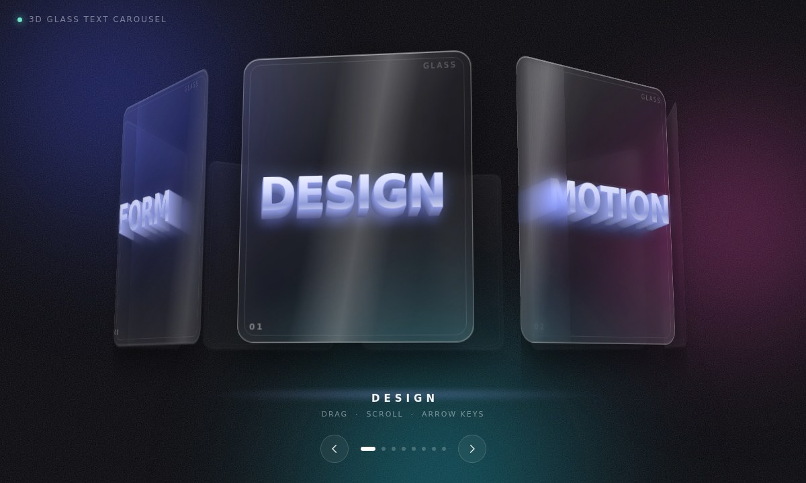

# 3D Glass Text Carousel

A rotating cylinder of frosted-glass panels — like the Framer *3D Glass Carousel*,
but each panel carries an **extruded 3D word** instead of an image.

No dependencies, no build step. Open `index.html`.



## How the 3D works

Two things make it read as a solid object rather than a set of flat cards:

**The cylinder.** Panels are laid out with `rotateY(i * step) translateZ(radius)`
inside a `preserve-3d` ring, where the radius is derived so N panels of the given
width seat evenly around the axis:

```
radius = (panelWidth / 2) / tan(π / N) * gap
```

The ring is then pushed back by `translateZ(-0.6 * radius)` so the nearest panel
sits close to the projection plane and isn't magnified out of frame.

**The type.** Each word is a stack of ~38 copies of itself, every copy offset a
little further back in Z *and* a little down-and-left in X/Y:

```css
transform: translate3d(
  calc(var(--i) * var(--text-shift-x)),
  calc(var(--i) * var(--text-shift-y)),
  calc(var(--i) * var(--text-step) * -1)
);
```

The slices shade from a lit edge near the face to near-black at the back, so they
form real extruded sides. The Z component means the extrusion parallaxes correctly
as a panel turns; the X/Y drift means the bevel still reads when a panel is square
to the camera.

### One thing to know if you edit this

Nothing may set `opacity` or `filter` on `.panel`. Either property flattens the
`preserve-3d` context and collapses the extrusion inside it into a single plane.
Depth cues (dimming, blur on distant glass) are applied to the **leaf** elements
instead, driven by a `--front` custom property that JS writes on each panel every
frame.

## Usage

```html
<link rel="stylesheet" href="styles.css" />
<div id="ring" data-words="DESIGN, MOTION, GLASS, DEPTH"></div>
<script src="carousel.js"></script>
<script>
  const c = new GlassTextCarousel('#ring');
  c.onChange((index, word) => console.log(index, word));
</script>
```

Options can be passed as a second argument or as `data-` attributes
(`data-words`, `data-autoplay`, `data-tilt`, `data-gap`, `data-depth`):

| Option | Default | What it does |
| --- | --- | --- |
| `words` | 6 sample words | The words on the panels; one panel per word |
| `autoplay` | `true` | Slow idle spin, resuming after `idleDelay` |
| `autoSpeed` | `0.09` | Degrees per frame while idling |
| `tilt` | `9` | Camera tilt in degrees |
| `gap` | `1.22` | `>1` pushes panels further from the axis |
| `depth` | `38` | Extrusion slices per word |
| `sensitivity` | `0.34` | Degrees of spin per pixel dragged |
| `friction` | `0.945` | Inertia decay after a flick |
| `idleDelay` | `2600` | Milliseconds of stillness before autoplay resumes |

Methods: `next()`, `prev()`, `goTo(index)`, `onChange(fn)`, `destroy()`.

## Interaction

Drag or swipe to spin, flick for inertia, scroll to nudge, arrow keys to step.
Motion settles by snapping to the nearest panel. Autoplay pauses on hover and
while the pointer is down, and is disabled entirely under
`prefers-reduced-motion: reduce`.

## Styling

Most of the look is in custom properties at the top of `styles.css`: `--glass-tint`
and `--glass-edge` for the panels, `--text-side-top` / `--text-side-bottom` for the
extrusion shading, `--text-step` and `--text-shift-x/y` for how deep and in which
direction the type extrudes, and `--panel-w` / `--panel-h` for card size.

Long words are scaled down automatically to fit their card — the fit runs on load,
on resize, and again once web fonts have settled.

## Browser support

Needs `transform-style: preserve-3d` and `color-mix()` — Chrome/Edge 111+,
Safari 16.2+, Firefox 113+. `backdrop-filter` provides the frost; without it the
panels fall back to their gradient tint and still work.
