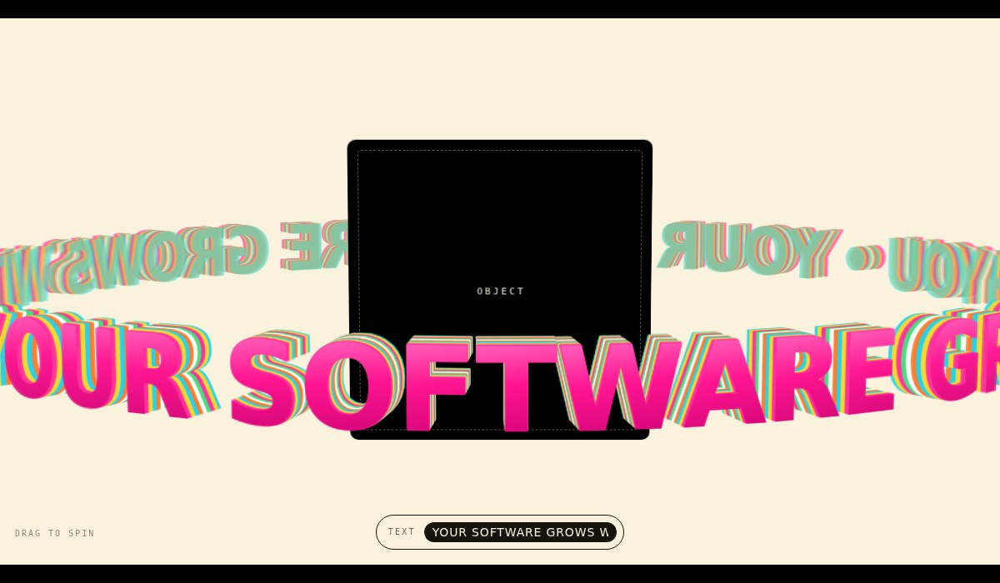

# Text Orbit

A word running around a 3D ring, passing **behind** whatever object sits at the
centre. Chunky glossy type with chromatic striped extrusion.

No dependencies, no build step. Open `index.html`.



## Dropping in your own object

The centre object is yours — the component keeps whatever you mark with
`[data-object]` and builds the ring around it:

```html
<div class="orbit" data-text="DYNAMIC" data-repeat="3">
  <div class="orbit__object" data-object>
    
  </div>
</div>
```

```js
new TextOrbit('.orbit');
```

The slot is pinned at `z = 0`, the letters sit at `±radius`, and all of them
share one `preserve-3d` context — so the browser sorts them by depth on its own.
Letters on the far side of the circle are drawn behind your object, letters on
the near side in front, with no z-index bookkeeping. The component sets
`--object-size` on the slot from the ring radius; ignore it and size the object
yourself if you'd rather.

## How the type is built

Each letter is a stack of ~26 copies of itself, each pushed a little further back
in Z. The slices cycle through a stripe palette (`band` slices per colour), which
is what produces the chromatic extruded sides:

```js
stripes: ['#ff2e9f', '#ffd62b', '#22d3ee', '#ff7a29', '#ffffff', '#4ade80']
```

Letters are placed round the rim with an arc proportional to each glyph's real
width, so spacing stays even instead of stepping by a fixed angle.

## Sizing: the ring leads, the type follows

The ring radius is a stage-relative choice (`ringScale`), and the length of arc it
offers then sets the type size:

```
type scale = radius × sweep / total text width
```

So a bigger ring or a shorter phrase gives bigger letters, and a longer phrase
gives smaller ones — the text always fits the arc exactly. `maxScale` stops two
short words from ballooning; when it bites, the ring pulls in instead so the
sweep stays exact. The camera distance is set from the radius (`perspective`,
a multiple of it), which keeps the nearest letters magnified by the same amount
whatever size the ring ends up.

This is the inverse of the obvious approach — deriving the radius from the text —
which pins the type to whatever the phrase happens to need and makes a long
sentence balloon the ring past the viewport.

## A note on `sweep`

`sweep` is how much of the circle the text covers. It works at any value, but
**180 has a catch**: with the text on half the ring, the other half of every
rotation shows an empty frame, because the whole run is behind the camera-facing
side. For the look of a half-circle — a gentle arc running off both edges, rather
than a tight ring — raise `ringScale` and use `repeat` to keep the circle
populated instead. That is what the defaults do: a large ring at `sweep: 360`
shows roughly a half-circle of text at any moment, and never empties.

### One thing to know if you edit this

Nothing may set `opacity` or `filter` on `.char`. Either property flattens the
`preserve-3d` context and collapses that letter's extrusion into a single plane.
The far half of the ring is faded through a `--front` custom property that JS
writes on each letter per frame, which the **leaf** elements read.

## Options

Pass as a second argument, or as `data-` attributes (`data-text`, `data-repeat`,
`data-separator`, `data-speed`, `data-tilt`, `data-spread`, `data-depth`):

| Option | Default | What it does |
| --- | --- | --- |
| `text` | `'YOUR SOFTWARE GROWS WITH YOU'` | The orbiting text |
| `repeat` | `2` | Times the text goes round the ring |
| `sweep` | `360` | Degrees of the circle the text occupies |
| `separator` | `' • '` | Set `''` to butt the repeats together |
| `speed` | `0.22` | Degrees per frame |
| `tilt` | `-7` | Ring tilt in degrees |
| `spread` | `1` | `>1` opens gaps between letters, `<1` crowds them |
| `depth` | `26` | Extrusion slices per letter |
| `band` | `3` | Slices per colour stripe |
| `objectScale` | `0.55` | Centre object size, relative to ring radius |
| `ringScale` | `0.55` | Ring radius, as a fraction of the stage |
| `maxScale` | `1.4` | Ceiling on type scale, so short text can't balloon |
| `perspective` | `3` | Camera distance, as a multiple of the radius |
| `start` | `-22` | Opening rotation |
| `stripes` | 6 colours | The extrusion palette |

Methods: `setText(word)` swaps the word and re-lays the ring without a rebuild;
`destroy()` tears it down.

Drag to spin with momentum; let go and it resumes its own rotation. Motion is
delta-time normalised, so it runs at the same rate on 60Hz and 120Hz, and
`prefers-reduced-motion: reduce` stops the idle spin.

## Styling

Colours and type live in custom properties at the top of `orbit.css`: `--cream`
for the ground, `--face-top` / `--face-mid` / `--face-bottom` for the glossy
letter faces, `--depth-step` for how far the extrusion reaches, `--type-size` for
the letters, and `--letterbox` for the black bars.

## Also in here

`glass-carousel.html` is an earlier take — a rotating cylinder of frosted-glass
panels carrying extruded 3D words. Same extrusion technique, different world.


## Browser support

Needs `transform-style: preserve-3d` — Chrome/Edge, Safari 16+, Firefox. Depth
sorting between the ring and the centre object relies on the browser compositing
one shared 3D context, which all current engines do.
